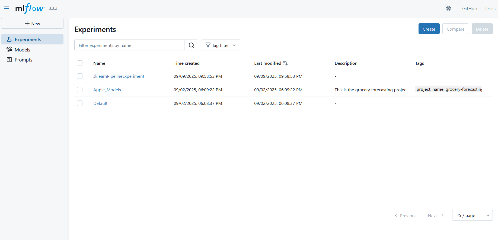
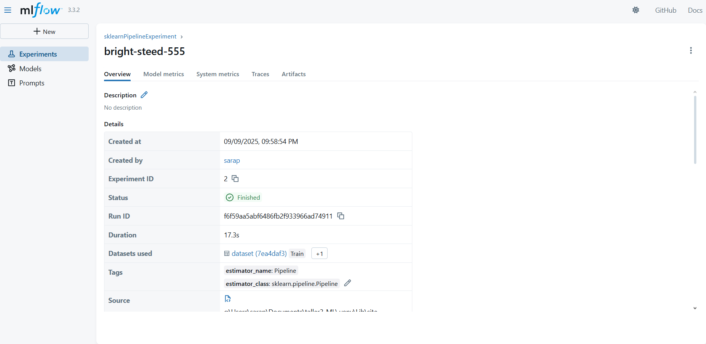
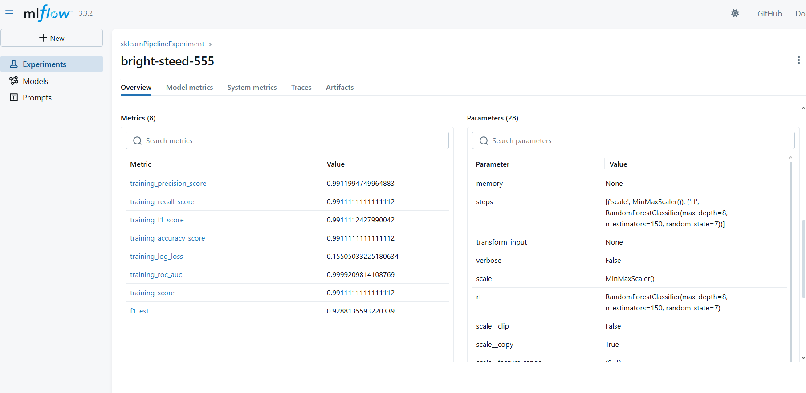

# Taller 3: MLFlow y Predicción de Ventas de Manzanas

Este taller explora el uso de MLFlow para el seguimiento de experimentos de machine learning, utilizando un caso práctico de predicción de demanda de manzanas en supermercados. Se generan datos sintéticos, se entrena un modelo de regresión y se registran los resultados y el modelo usando MLFlow.

## Requisitos
- Python 3.10 o superior
- [uv](https://github.com/astral-sh/uv) como manejador de paquetes

## Instalación
1. Instala uv si no lo tienes:
   ```powershell
   pip install uv
   ```
2. Instala las dependencias del proyecto:
   ```powershell
   uv pip install -r requirements.txt
   ```
   O para instalar y resolver dependencias desde el archivo pyproject.toml:
   ```powershell
   uv pip install .
   ```

# Preparacion del servidor de monitoreo. 

   En una terminal, a nivel del folder del proyecto, ejecutar el siguiente comando:

   ```powershell
   mlflow server --host 127.0.0.1 --port 8080 --backend-store-uri sqlite:///mlflow.db --default-artifact-root ./mlruns
   ```

## Uso
1. Inicia el servidor de MLFlow (opcional, si quieres ver la UI):
   ```powershell
   mlflow ui
   ```
2. Abre el notebook `Taller3.ipynb` y sigue las instrucciones paso a paso.

## Notas
- El taller incluye generación de datos sintéticos, entrenamiento de modelos y registro de experimentos en MLFlow.
- Puedes consultar la documentación oficial de MLFlow para más detalles: https://mlflow.org/docs/latest/index.html

## Evidencias
Las siguientes capturas muestran los experimentos registrados en MLFlow:

  
  


## Conclusión
El taller permitió comprobar la facilidad con la que MLFlow se integra con scikit-learn para registrar métricas, parámetros y modelos. La automatización que ofrece al trabajar con pipelines simplifica el seguimiento de experimentos y evita la pérdida de información relevante. De esta forma, se confirma el valor de MLFlow como herramienta práctica para proyectos que requieren trazabilidad, comparación de modelos y control de versiones, tanto en entornos académicos como profesionales.